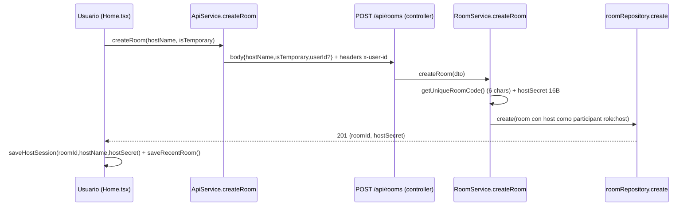
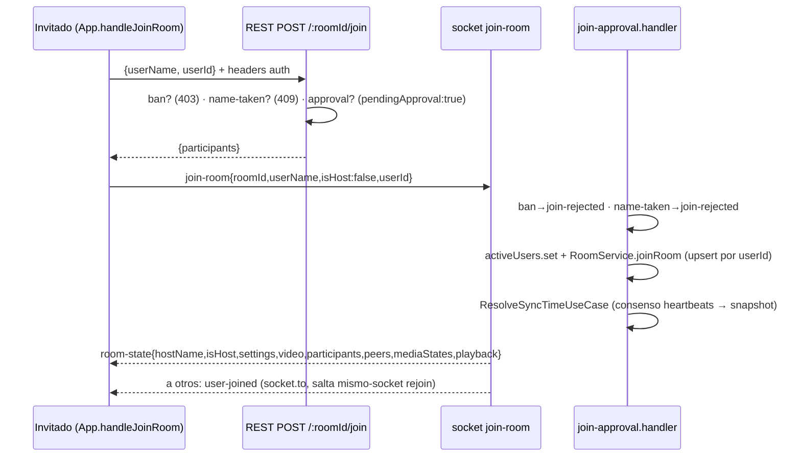
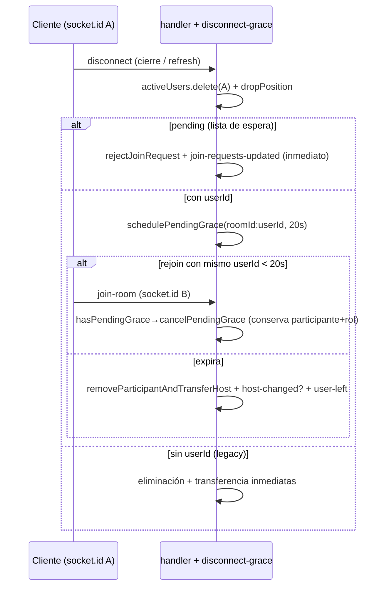
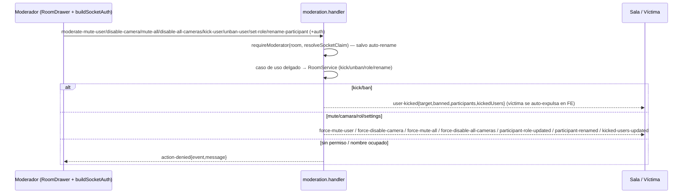
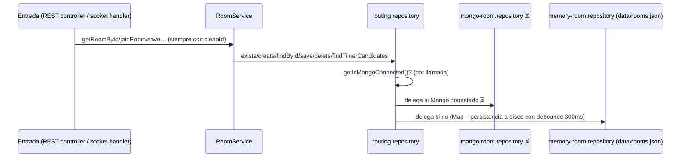

# SEQUENCES — 8 flujos verificados

Convenciones: `roomId` normalizado en servidor; `A → B: evento(payload)` =
socket; `A ⇒ B: método()` = llamada/REST. Solo pasos leídos en código.

## 1. Crear sala (REST + sesión host)



## 2. Unirse (caso simple, sin approval)



Puertas paralelas: el REST añade al participante **y** el socket también
(`joinRoom` es upsert idempotente por `userId`, por eso no duplica).

## 3. Approval (sala con `requireApproval`)

```mermaid
sequenceDiagram
    participant G as Invitado
    participant H as Host (RoomDrawer/Solicitudes)
    participant BE as handler
    G->>BE: join-room{…}
    BE->>BE: requireApproval && !host && !alreadyParticipant
    BE->>BE: activeUsers.set{pending:true} + addJoinRequest (dedupe por userId)
    BE-->>G: join-pending (FE muestra WaitingApproval)
    BE-->>H: join-requests-updated (toast si es nuevo)
    alt aprobar
        H->>BE: approve-join{userId|name + auth}
        BE->>BE: requireModerator else action-denied
        BE->>BE: ApproveJoinUseCase (mueve request→participants)
        BE-->>G: join-approved{roomId} (al socket pendiente)
        BE-->>H: join-requests-updated + user-joined (io.to: incluye aprobador)
        G->>BE: join-room (re-join; recibe room-state + peers)
    else rechazar / ban
        H->>BE: reject-join{…ban? + auth}
        BE-->>G: join-rejected{rejected|banned} + borra su activeUsers
        BE-->>H: join-requests-updated (+kicked-users-updated si ban)
    end
```

## 4. Reconexión / gracia de refresh (20 s)



`leave-room` voluntario es inmediato y cancela gracias pendientes.
`user-left` solo se emite al eliminar de verdad. El FE además re-emite
`join-room` en cada `connect` (reconexión a nivel socket.io).

## 5. Chat y reacciones (broadcast puro)

```mermaid
sequenceDiagram
    participant A as Cliente A (handleSendMessage/handleReaction)
    participant BE as chat-reactions.handler
    participant B as Sala (io.to(roomId))
    A->>BE: send-message{roomId,text,userName} (sin auth)
    BE->>BE: solo exige text.trim() no vacío; id = Math.random()
    BE-->>B: chat-message{id,user,text,timestamp HH:MM}
    A->>BE: send-reaction{roomId,emoji,userName} (sin auth)
    BE-->>B: reaction{id,emoji,user,xOffset}
```

Sin persistencia (el historial vive solo en el estado React; al recargar se
pierde). Sin validación de longitud ni sanitización.

## 6. Sync de video (emisión + consenso de entrada + heartbeat)

```mermaid
sequenceDiagram
    participant H as Cualquiera (onSyncAction)
    participant BE as sync-playback.handler
    participant M as Miembros (socket.to)
    participant V as VideoPlayer (remoto)
    participant N as Recién llegado
    H->>BE: sync-video{roomId,action,currentTime} (sin auth)
    BE->>BE: SyncPlaybackUseCase → setPlaybackSnapshot (memoria)
    BE-->>M: sync-video{action,currentTime,sentAt,senderSocketId}
    M->>V: aplica con compensación (Date.now()-sentAt)s; seek si diff>2s
    loop heartbeat ~5s (VideoPlayer→Room.tsx→socket)
        M->>BE: playback-heartbeat{roomId,currentTime,isPlaying} (solo miembros)
        BE->>BE: RecordHeartbeatUseCase → roomPositions[socketId]
    end
    N->>BE: join-room
    BE->>BE: ResolveSyncTimeUseCase: mediana del cluster mayoritario (±3s, TTL 12s); sin mayoría gana el más antiguo; fallback snapshot con elapsed
    BE-->>N: room-state.playback{currentTime,isPlaying}
```

## 7. Moderación (patrón único con variantes)



`rename-participant` además re-keyea `activeUsers` y `activeMediaStates`
(clave por nombre en minúsculas) — acoplamiento nombre-como-clave.

## 8. Persistencia (routing + doble vía de video)



Doble vía de video (divergencia posible): `POST /:roomId/video` o `/video-url`
(REST, exige host, persiste en BD) **+** `video-changed` por socket (sin auth,
solo broadcast + reset de snapshot). El FE ejecuta REST y, si ok, emite el
socket. `streamVideo` sirve fichero local con `206 Partial Content` (chunks
3 MB) o redirige a `directUrl` para `hls/url`. Borrado físico solo si
`forceDeleteVideo` o sala temporal; si no, el fichero se conserva.
Timer-sweep (`room.socket.ts` cada 15 s) cierra salas con `timerEndsAt` pasado.
